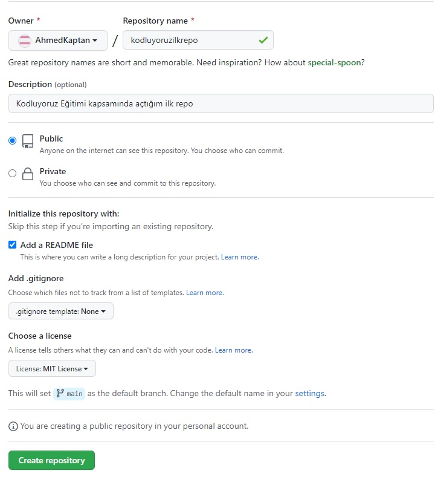

# Kodluyoruz Ilk Repo

Bu repo [Kodluyoruz](https://www.kodluyoruz.org/) Front-End Eğitiminde oluşturduğumuz ilk repo.İçerisinde  bir adet README dosyası, bir adet de index.html barındırıyor.

[]

## Installation
öncelikle project clonelayın.(Buraya sizin reponuzdan aldığınız link gelecek)

```
git clone https://github.com/AhmedKaptan/442924.git
```
## Usage 
Projeyi cloneladıktan sonra Visual Studio Code programından açınız

Linux için:     

```
cd kodluyoruzilkrepo
code .
```

## Contributing
Pull requestler kabul edilir.Büyük değiiliklikler için, lütfen önce neyi değiştirmek istediğinizi tartışmak için bir konu açınız.

## License

[MIT](https://opensource.org/licenses/MIT)


## Patikam

[patika](https://app.patika.dev/kaptanreis)
